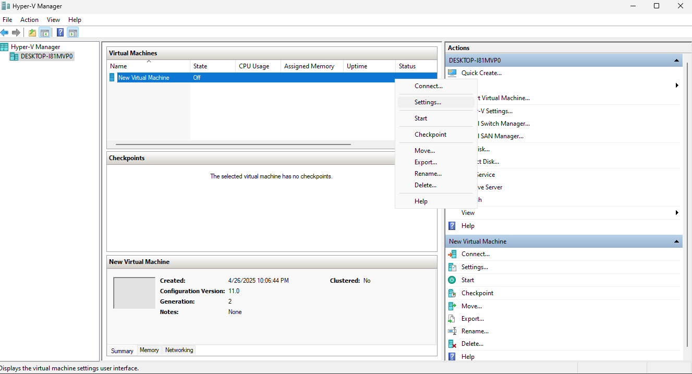
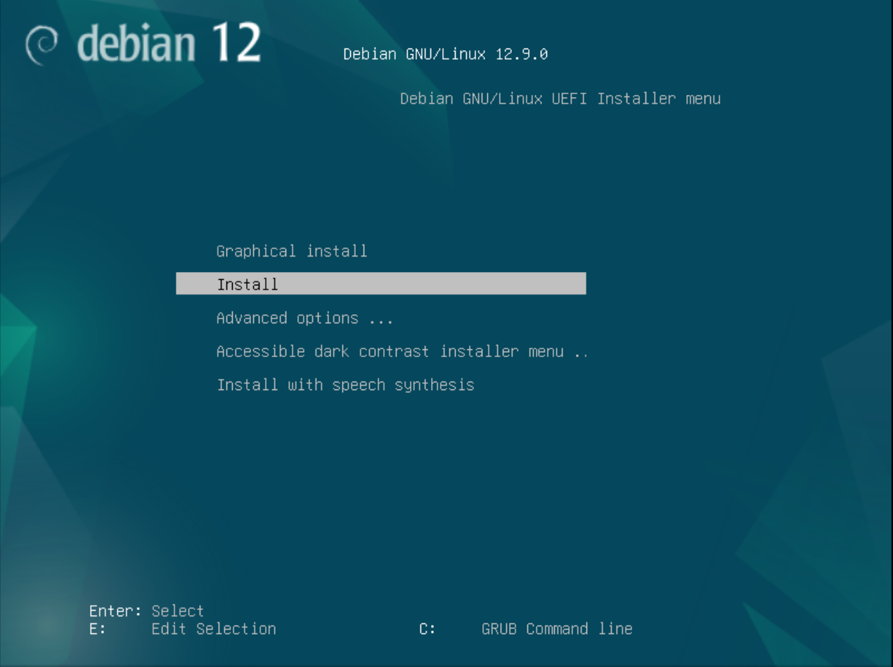
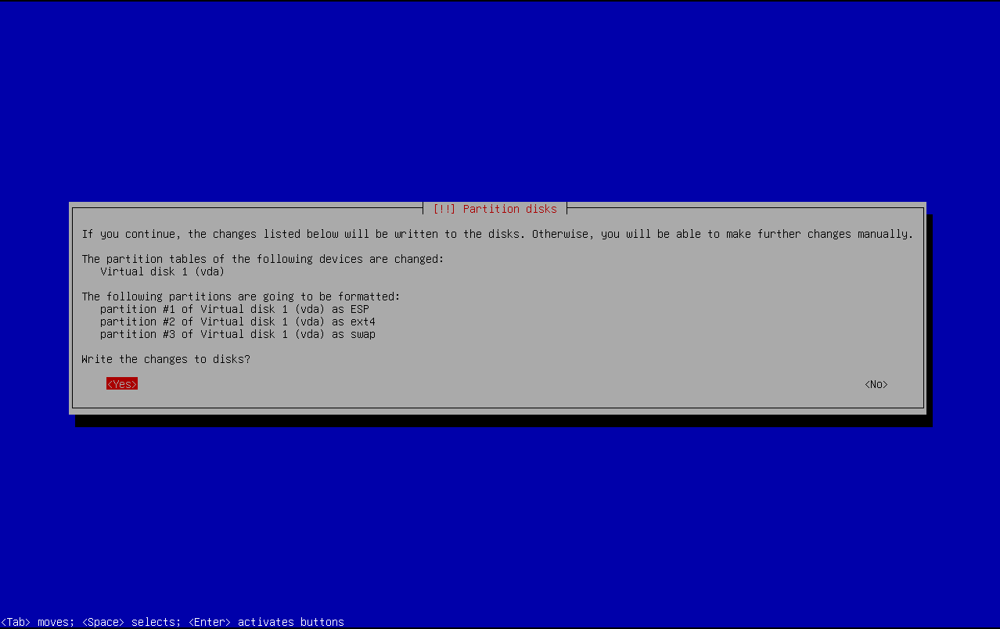

# Setup Hyper-V & Install Debian

## Prequisites

- Win10/11
- Debian ISO

## Hyper-V Steps

### WIN + R -> control -> OK

> 

### Programs and Features

> 

### Turn Windows features on or off

> 

### Enable Hyper-V && Reboot after Hyper-V is Installed

> 

### Launch Hyper-V

> 

### New -> Virtual Machine

> 

### Next

> 

### Name Machine

> 

### Set Generation 2

> 

### Set startup memory -> [X] Use Dynamic Memory for this virtual machine

> 

### Set Default Switch

> 

### Set Name & Size

> 

### [X] Install an operating system later -> Finish

> 

### Go to Settings

> 

### Disable [ ] Enable Secure Boot

> 

### Set Num of vCPU

> 

### Add DVD Drive

> 

### Add the debian ISO -> Apply

> 

### Push the DVD boot option to the top -> Apply

> 

### Disable Auto Start

> 

### Set Auto Stop Option -> OK

> 

### Double Click The Machine

> 

## Debian Steps

### Install

> 

### Language - English

> 

### Country

> 

### Continent or region

> 

### Country, territory or area

> 

### Locale - United States (default)

> 

### Keymap

> 

### Hostname

> 

### Domain name

> 

### Set Root Passwd

> 

### User Name

> 

> 

### User Passwd

> 

### Time Zone - Azores

> 

### Partitioning method - Guided - use entire disk

> 

### Select Disk - (default)

> 

### Partitioning scheme - All files ... (default)

> 

### Finish

> 

### Write changes to disk - YES (NOT DEFAULT)

> 

### Let It Be

> 

### Extra Media - NO

> 

### Use net mirror - YES

> 

### Mirror Country

> 

### Archive mirrror - (default)

> 

### HTTP proxy -  leave empty (default)

> 

### Participate in survey - NO ... NO

> 

### Software - Unselect all but ssh & standard ... (use space to select or deselect and enter to continue)

> 

### Finish

> 

### Enjoy

> 
